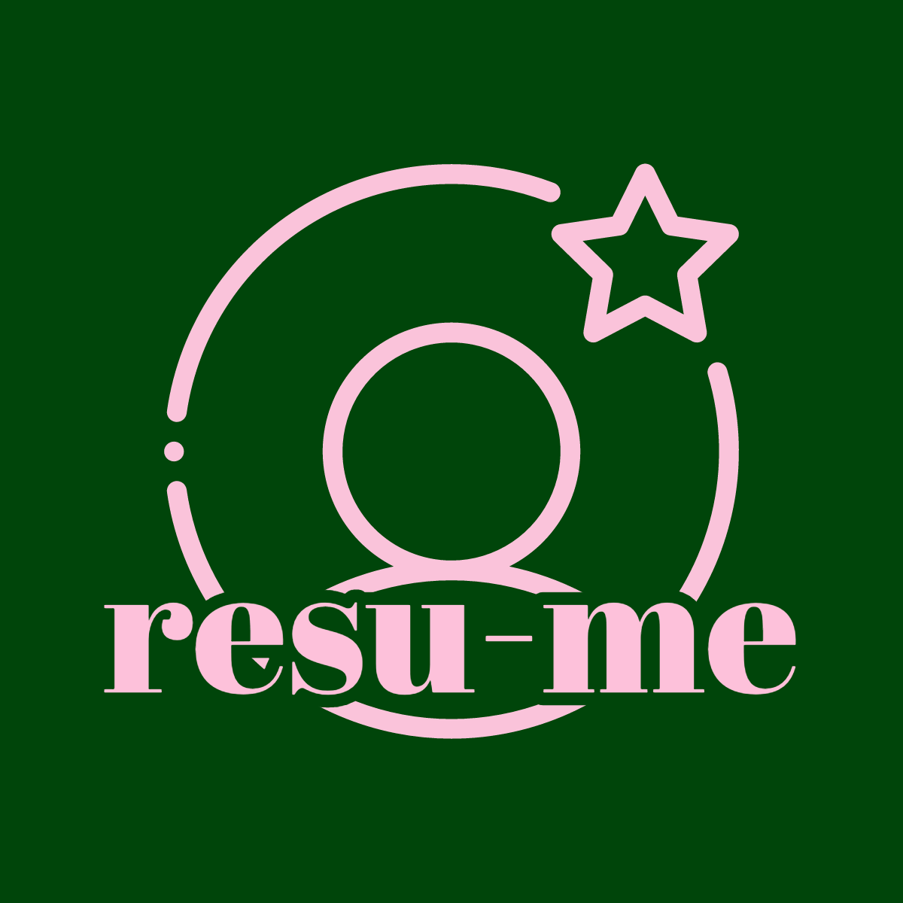

<p align="center">
  <i align="center">Craft your professional journey with ease</i> 📄✨
</p>

# resu-me
#### Video Demo: (https://youtu.be/TUyz8_qLm1Y)
#### Description: 
`resu-me` is a dynamic resume generator designed to simplify and enhance the process of spinning up professional resumes. Whether you're a seasoned professional or just starting, `resu-me` makes it easy to produce polished and personalized resumes that stand out. Note: The development of `resu-me` leans towards applicants for technical roles. However, usage is open to all applicants.  

Check out the live version here: [resu-me Demo](https://bright-yeot-7554ea.netlify.app/).

### Key Features

- **Customizable Sections**: Add and modify sections like education, experience, skills, and projects to suit your professional background.
- **Interactive Preview**: See real-time updates as you build your CV, ensuring every detail is just right.
- **Mobile Responsive Design**: Craft your resume on any device with an interface optimized for both desktop and mobile.

## Technical Details

### Technologies Used
- **React**: A JavaScript library for building user interfaces, allowing `resu-me` to have a dynamic and responsive frontend.
- **Vite**: An incredibly fast frontend build tool, enhancing the development experience with features like Hot Module Replacement (HMR).

### Dynamic Form Handling
`resu-me` employs robust form handling to capture and organize your professional data efficiently, ensuring a smooth user experience.

### Responsive Design
Tailored for flexibility, `resu-me` adapts to various screen sizes, making it accessible and user-friendly across all devices.

## Getting Started

### Prerequisites

- Node.js v21.6.2

### Installation

```bash
npm install
```
### Running the Project

#### For development:

```bash
npm run dev
```

#### For production:

```bash
npm run build
```

## Usage and Examples

1. **Input Your Details**: Fill in your information across various sections like General, Education, Experience, etc.
2. **Customize Your Layout**: Arrange sections as per your preference, and watch the live preview update instantly.
3. (Coming soon) **Export as PDF**: Once satisfied with the layout and content, export your CV as a PDF, ready to be shared. 

## Contribution and Support

### Contributing

`resu-me` is open to contributions. Whether it's a feature suggestion, bug report, or code contribution, your input is valuable. Feel free to fork the repository, try it out, and share your findings. 

Please read [CONTRIBUTING.md](CONTRIBUTING.md) for details on our code of conduct, and the process for submitting pull requests to us.

### Support

For support or to report issues, contact me at [hello@codebykevin.dev](mailto:hello@codebykevin.dev). 

## Acknowledgements and References

This project utilizes resources from [Tailwind CSS](https://tailwindcss.com/docs/installation) and [Vite](https://vitejs.dev/guide/) documentation, UI Colors' [Tailwind CSS Color Generator](https://uicolors.app/create) for styling, [Netlify](https://docs.netlify.com/) for deployment, along with third-party libraries like [react-phone-number-input](https://gitlab.com/catamphetamine/react-phone-number-input#readme), [react-tooltip](https://github.com/ReactTooltip/react-tooltip#readme) and the [MUI X](https://mui.com/x/introduction/) component library. 

Resume template and tips are referenced from [r/cscareerquestions](https://www.reddit.com/r/cscareerquestions/) and [r/EngineeringResumes](https://www.reddit.com/r/EngineeringResumes/).

## License

This project is licensed under the MIT License - see the [LICENSE.md](LICENSE.md) file for details
